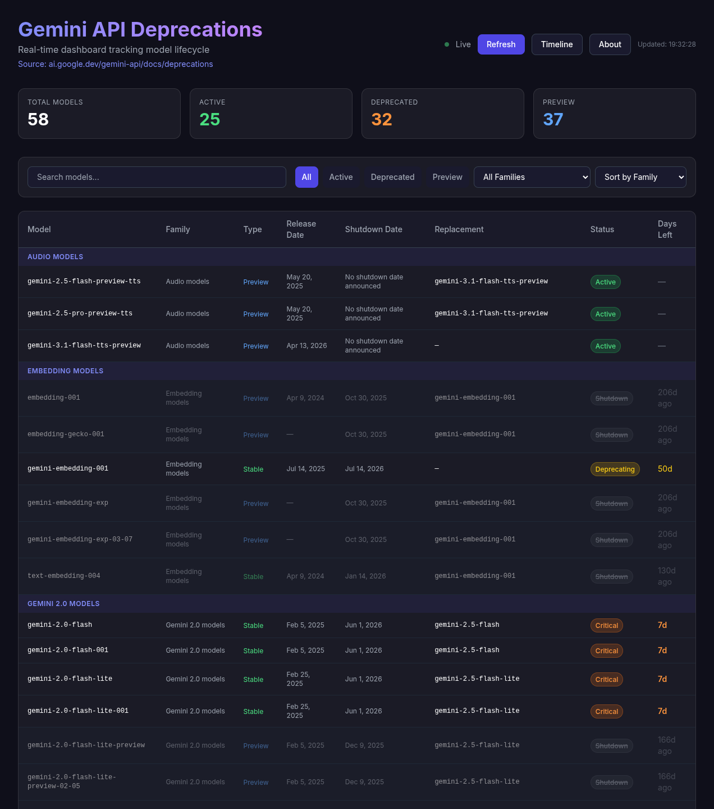
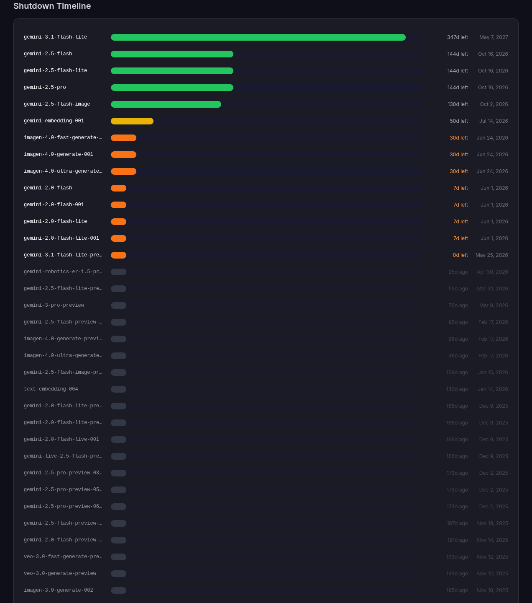

# Gemini API Deprecations Dashboard

Dashboard interactivo de página única para monitorear en tiempo real el ciclo de vida y deprecaciones de modelos de [Gemini API](https://ai.google.dev/gemini-api/docs/deprecations).

### [>> Pruébalo en vivo <<](https://pfelipm.github.io/gemini-models/)


*Vista principal de modelos con filtros y estadísticas*


*Vista de timeline de shutdown ordenada por fecha descendente*

---

## Arquitectura

| Capa | Tecnología |
|------|-----------|
| Marcado | HTML5 vanilla |
| Estilos | TailwindCSS vía CDN + CSS custom |
| Lógica | ES6+ vanilla (sin frameworks, sin dependencias) |
| Fuente de datos | HTML remoto scrapeado en tiempo de ejecución vía `fetch()` |
| Despliegue | Archivo estático — sirve desde cualquier sitio o abre localmente |

Cero dependencias npm. Cero paso de build. Un archivo.

---

## Pipeline de datos

### Estrategia de fetch (al cargar la página + refresh manual)

```
1. Fetch directo → https://ai.google.dev/gemini-api/docs/deprecations
   │
   ├─ éxito → parsear HTML
   │
   └─ fallo (CORS) → intentar proxies CORS en orden:
       │
       ├─ https://api.allorigins.win/raw?url=...
       │
       ├─ https://corsproxy.io/?...
       │
       ├─ https://api.codetabs.com/v1/proxy?quest=...
       │
       ─ todos fallan → usar FALLBACK_DATA embebido
```

### Parseo de HTML (`parseHTML`)

La página de Google contiene tablas organizadas por familias de modelos. El parser usa `DOMParser` para extraer:

| Elemento | Identificado por | Campos extraídos |
|----------|-----------------|------------------|
| **Encabezados** | `<h2>`, `<h3>` que contienen "Gemini" o "model" | Nombre de la familia |
| **Tablas** | `<table>` siguientes a cada encabezado | `name`, `releaseDate`, `shutdownDate`, `replacement` |

La validación de modelos (`isValidModelName`) filtra filas que no son modelos válidos:
- Debe tener al menos un guión (estructura `familia-version-nombre`)
- Ejemplos válidos: `gemini-3.5-flash`, `gemini-2.5-pro-preview-06-05`, `text-embedding-004`

### Datos de respaldo

`loadFallbackData()` es un array de 16 modelos embebido en el archivo. Se usa cuando todas las peticiones de red fallan. Es navegable inmediatamente al abrir la página.

---

## Modelo de datos

Cada modelo es un objeto con esta estructura:

```js
{
  name:          string,   // Nombre del modelo, ej. "gemini-3.5-flash"
  family:        string,   // Familia, ej. "Gemini 3 models"
  isPreview:     boolean,  // true si es versión preview
  releaseDate:   string,   // Fecha de lanzamiento, ej. "May 19, 2026"
  shutdownDate:  string,   // Fecha de cierre, ej. "October 16, 2026"
  replacement:   string,   // Modelo de reemplazo, ej. "gemini-3.1-pro-preview"
}
```

### Estados del modelo

El estado se calcula dinámicamente según los días restantes hasta el shutdown:

| Estado | Condición | Color |
|--------|-----------|-------|
| **Active** | Sin fecha de shutdown | Verde |
| **Preview** | `isPreview === true` | Azul |
| **Warning** | ≤ 90 días para shutdown | Amarillo |
| **Critical** | ≤ 30 días para shutdown | Naranja |
| **Shutdown** | Fecha de shutdown ya pasó | Gris (tachado) |

---

## Funcionalidades

### Filtrado

| Control | Comportamiento |
|---------|---------------|
| **Buscador** | Filtro de texto en tiempo real sobre `name`, `family` y `replacement` |
| **Chips de estado** | All / Active / Deprecated / Preview (selección única) |
| **Selector de familia** | Filtra por familia de modelos (ej. "Gemini 3 models", "Gemini 2.5 Pro models") |

### Ordenamiento

| Opción | Descripción |
|--------|-------------|
| **Sort by Family** | Agrupa por familia de modelos |
| **Shutdown Date ↑** | Ordena por fecha de shutdown ascendente (más urgente primero) |
| **Shutdown Date ↓** | Ordena por fecha de shutdown descendente |
| **Release Date ↓** | Ordena por fecha de lanzamiento descendente (más reciente primero) |

### Tarjetas de estadísticas

Cuatro tarjetas resumen en la parte superior, calculadas a partir de todos los datos:
- **Total Models**: Cantidad total de modelos
- **Active**: Modelos activos (sin fecha de shutdown)
- **Deprecated**: Modelos en warning, critical o shutdown
- **Preview**: Modelos en versión preview

### Timeline de Shutdown

Visualización gráfica de barras que muestra:
- Modelos con fecha de shutdown ordenados descendente
- Barras proporcionales a los días restantes
- Colores según urgencia (verde → amarillo → naranja → gris)
- Días restantes o "Xd ago" si ya pasó la fecha

### Indicador de estado

Una píldora en el encabezado muestra el estado de la fuente de datos:
- **Live** (verde) — parseado correctamente desde el remoto
- **Fallback** (amarillo) — usando datos de respaldo

### Botón de actualizar

Re-ejecuta el pipeline completo de fetch. Sin refresh automático — solo bajo demanda.

### Modal de atribución

El botón "About" abre un modal con la foto del autor, nombre y enlaces a sus perfiles de LinkedIn y GitHub. Se cierra con clic en el overlay, el botón de cierre o la tecla `Escape`.

---

## Diseño visual

- **Tema oscuro** con efecto glassmorphism (backdrop-blur, bordes semitransparentes)
- **Badges de estado**: píldoras codificadas por color según el estado del modelo
- **Badges de tipo**: Preview (azul) / Stable (verde)
- **Timeline visual**: barras de progreso con gradiente de color según urgencia
- **Responsivo**: tabla con scroll horizontal en móvil, layout adaptable
- **Animaciones**: fade-in al cargar, pulse en el indicador live, hover effects

---

## Estructura de archivos

```
.
├── index.html    # SPA completa (HTML + CSS + JS en un archivo)
└── README.md     # Este archivo
```
.
├── gemini-deprecations-dashboard.html    # SPA completa (HTML + CSS + JS en un archivo)
└── README.md                              # Este archivo
```

---

## Ejecución

```bash
# Opción 1: Abrir directamente
open index.html              # macOS
xdg-open index.html          # Linux

# Opción 2: Servidor HTTP simple (necesario para algunos proxies CORS)
python3 -m http.server 8000
# Luego visitar http://localhost:8000

# Opción 3: Cualquier host estático (Netlify, Vercel, GitHub Pages, etc.)
# Simplemente despliega el archivo index.html
```

---

## Limitaciones

- **CORS**: El fetch directo a `ai.google.dev` será bloqueado por la política de same-origin. El fallback de proxies lo maneja, pero los proxies pueden tener límites de tasa o caídas.
- **Fragilidad del parseo**: Si la estructura de la página fuente cambia (encabezados, orden de columnas), el parser puede romperse. Los datos de respaldo aseguran que el dashboard siempre funcione.
- **Sin persistencia**: El estado de filtros y ordenamiento está solo en memoria — se pierde al recargar la página.
- **Sin componente de servidor**: Toda la computación es del lado del cliente. No se necesitan claves de API.

---

## Autor

**Pablo Felip**
- [LinkedIn](https://www.linkedin.com/in/pfelipm/)
- [GitHub](https://github.com/pfelipm/)

---

## Licencia

Este proyecto se proporciona tal cual para uso educativo y personal. Los datos de deprecaciones pertenecen a [Google](https://ai.google.dev/gemini-api/docs/deprecations).
